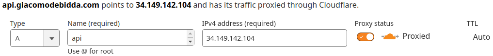

# External HTTP(S) load balancer (L7)

This GCP project uses an [External HTTP(S) Load Balancer](https://cloud.google.com/load-balancing/docs/https), a proxy-based Layer 7 load balancer. This setup allows us to keep all of the project services behind a **single external, static** IP address (anycast IP address).

## Preliminary operations

1. Check that [gcloud is configured correctly](./gcloud-configuration.md).
1. Provision the Managed Instance Groups you want to use as backend services behind the load balancer's front end. Each MIG includes one or more Compute Engine VMs.
1. Deploy the Cloud Run services you want to use as backend services behind the load balancer's front end.

## 1 - Reserve an external, static IP address

Set up a [global static external IP address](https://cloud.google.com/compute/docs/ip-addresses/reserve-static-external-ip-address), which will be the **only IP address reachable from outside** of the [VPC network](https://cloud.google.com/vpc/docs/vpc) of the project.

```sh
gcloud compute addresses create ip-https-load-balancer \
  --network-tier PREMIUM \
  --ip-version IPV4 \
  --global \
  --description 'global external static IPv4 address for the HTTPS load balancer'
```

Check that the address was created and its status is `RESERVED` or `IN_USE`.

```sh
gcloud compute addresses list

gcloud compute addresses describe ip-https-load-balancer \
  --global
```

You can also check the external IP address in the Google Cloud Console, in [VPC network > IP addresses](https://console.cloud.google.com/networking/addresses/list?project=prj-kitchen-sink).

## 2 - Create SSL certificates

To create an HTTPS load balancer, you must add an SSL certificate resource to the load balancer's front end. The load balancer front end is a managed service of [Google Front End (GFE)](https://cloud.google.com/docs/security/infrastructure/design#google_front_end_service).

To create a [Google-managed SSL certificate](https://cloud.google.com/load-balancing/docs/ssl-certificates/google-managed-certs), you must have registered a domain and configured the DNS records for that domain in order for the certificate to be provisioned. See [here](https://cloud.google.com/load-balancing/docs/https/setup-global-ext-https-serverless?hl=en#ssl_certificate_resource) for details.

You can either create a SSL certificate for a **single subdomain**...

```sh
gcloud compute ssl-certificates create ssl-cert-api-giacomodebidda-com \
  --description 'Google-managed SSL certificate for api.giacomodebidda.com' \
  --domains api.giacomodebidda.com \
  --global
```

...or you can create a SSL certificate for **multiple subdomains**:

```sh
gcloud compute ssl-certificates create ssl-cert-subdomains-giacomodebidda-com \
  --description 'Google-managed SSL certificate for some subdomains of giacomodebidda.com' \
  --domains analytics.giacomodebidda.com,audit.giacomodebidda.com \
  --global
```

It would be nice to create a SSL certificate with a wildcard, but you cannot do it. For that you would need [Certificate Manager](https://cloud.google.com/certificate-manager/docs?authuser=1) (which you would need to deploy).

Overall, I think it makes more sense to provision a **single certificate** for **each individual subdomain**.

Check that the SSL certificates were created and their status is `PROVISIONING`.

```sh
gcloud compute ssl-certificates list
```

You can also check the [SSL certificates on the web UI](https://console.cloud.google.com/net-services/loadbalancing/advanced/sslCertificates/list?project=prj-kitchen-sink).

> :information_source: **Note:**
>
> Provisioning a Google-managed certificate might take up to 60 minutes from the moment your DNS and load balancer configuration changes have propagated across the internet.
> Keep in mind that the [DNS propagation can take up to 72 hours](https://cloud.google.com/load-balancing/docs/ssl-certificates/troubleshooting#domain-status).
> You can check the DNS propagation on [dnschecker.org](https://dnschecker.org/).

You can check the details of a SSL certificate:

```sh
gcloud compute ssl-certificates describe ssl-cert-api-giacomodebidda-com \
  --format="get(name,managed.status)"
```

If you have any issues with SSL certificates, see [Troubleshooting SSL certificates](https://cloud.google.com/load-balancing/docs/ssl-certificates/troubleshooting) and [check you are not proxied the domain with Cloudflare](https://stackoverflow.com/questions/53886750/google-managed-ssl-certificate-stuck-on-failed-not-visible).

## 3 - Create NEGs (Network Endpoint Groups)

A [network endpoint group (NEG)](https://cloud.google.com/load-balancing/docs/negs) is a configuration object that specifies a group of backend endpoints or services.

### Create a zonal NEG for each Compute Engine VM instance

Create a [zonal NEG](https://cloud.google.com/load-balancing/docs/negs#zonal-neg) of type [GCE_VM_IP_PORT](https://cloud.google.com/load-balancing/docs/negs/setting-up-zonal-negs#zonal_negs_with_gce_vm_ip_port_endpoints):

```sh
gcloud compute network-endpoint-groups create api-milan \
  --zone europe-west8-a \
  --network-endpoint-type gce-vm-ip-port
```

Check that the zonal NEG was created:

```sh
gcloud compute network-endpoint-groups describe api-milan
```

### Create a serverless NEG for each Cloud Run service

The load balancer uses a [serverless NEG](https://cloud.google.com/load-balancing/docs/negs#serverless-neg) backend to direct requests to a Cloud Run service. This NEG must be in the same GCP region of the Cloud Run service.

There should be a ratio 1:1 of a Cloud Run service with a serverless NEG.

Check the **name** of each Cloud Run service and in which **region** it is deployed.

```sh
gcloud run services list
```

Create a serverless NEG for the `audit-production` service.

```sh
gcloud compute network-endpoint-groups create audit-milan \
  --region europe-west8 \
  --network-endpoint-type serverless  \
  --cloud-run-service audit-production
```

Create a serverless NEG for the `dash-earthquakes-production` service.

```sh
gcloud compute network-endpoint-groups create dash-earthquakes-frankfurt \
  --region europe-west3 \
  --network-endpoint-type serverless  \
  --cloud-run-service dash-earthquakes-production
```

Check that the NEGs were created.

```sh
gcloud compute network-endpoint-groups list
```

You can also check the Network endpoint groups in the Google Cloud Console, in [Compute Engine > Network endpoint groups](https://console.cloud.google.com/compute/networkendpointgroups/list?project=prj-kitchen-sink).

## 4 - Create backend services

A backend service defines how Cloud Load Balancing distributes traffic.

### Add the network endpoints to the zonal NEG

The VM instance we provisioned is called `vm-development` and has a running web server (nginx) on port 80. If you want to verify it, run these commands:

```sh
# connect to the VM
gcloud compute ssh giacomo@vm-development
# from within the VM, verify that nginx is running
systemctl status nginx
```

We want to allow HTTP traffic on port 80 coming from **within the VPC**. Remember, [backend VMs in backend services](https://cloud.google.com/load-balancing/docs/backend-service#backend_vms_and_external_ip_addresses) do **not** need external IP addresses, so they are not exposed to the public internet (also, we couldn't even use an external IP address with a zonal NEG). Only the External HTTP(S) Load Balancer is reachable from the outside world.

```sh
gcloud compute network-endpoint-groups update api-milan \
  --add-endpoint "instance=vm-development,ip=${VM_DEVELOPMENT_INTERNAL_IP},port=80"
```

You can check the zonal NEG using this command...

```sh
gcloud compute network-endpoint-groups list-network-endpoints api-milan
```

...or [visiting the web UI](https://console.cloud.google.com/compute/networkendpointgroups/europe-west8-a/neg-vm-development/details?q=search&referrer=search&project=prj-kitchen-sink).

Remember: a [zonal NEG](https://cloud.google.com/load-balancing/docs/backend-service#zonal_network_endpoint_groups) can have [one or more endpoints](https://cloud.google.com/load-balancing/docs/negs#zonal-neg), for example `VM_INTERNAL_IP:80`, `VM_INTERNAL_IP:3000`, etc.

### Create health checks

Create a [health check](https://cloud.google.com/load-balancing/docs/health-checks) to determine if applications in your VMs respond to requests. They're used for load balancing and with auto-healing in managed instance groups.

It's best to use a [health check whose protocol matches the protocol used by the load balancer's backend service](https://cloud.google.com/load-balancing/docs/health-checks#hc-lb-protocols) or target pool.

```sh
gcloud compute health-checks create http http-80 \
  --global \
  --description "HTTP health check on port 80" \
  --port 80 \
  --check-interval 300s \
  --timeout 5s \
  --healthy-threshold 1
```

Retrieve the [list of health checks](https://console.cloud.google.com/compute/healthChecks?project=prj-kitchen-sink):

```sh
gcloud compute health-checks list
```

Check the configuration of the health check:

```sh
gcloud compute health-checks describe http-80
```

### Create the backend service `api-service`

```sh
gcloud compute backend-services create api-service \
  --load-balancing-scheme EXTERNAL_MANAGED \
  --global \
  --protocol HTTP \
  --health-checks http-80 \
  --global-health-checks
```

### Add a zonal NEG to a backend service

```sh
gcloud compute backend-services add-backend api-service \
  --network-endpoint-group api-milan \
  --network-endpoint-group-zone europe-west8-a \
  --global \
  --balancing-mode RATE \
  --max-rate-per-endpoint 5 \
  --description 'Configuration to distribute traffic among all VMs of the api-milan zonal NEG'
```

Check that `api-service` appears among the list of backend services and that the zonal NEG `api-milan` is attached to it.

You can check using this command...

```sh
gcloud compute backend-services list
```

...or [visiting the web UI](https://console.cloud.google.com/net-services/loadbalancing/list/backends?project=prj-kitchen-sink).

### Create one backend service for each serverless NEG

A [serverless NEG](https://cloud.google.com/load-balancing/docs/backend-service#serverless_network_endpoint_groups) can resolve to [only one endpoint](https://cloud.google.com/load-balancing/docs/negs#serverless-neg).

Create a backend service for `neg-audit`

```sh
gcloud compute backend-services create backend-audit \
  --load-balancing-scheme EXTERNAL_MANAGED \
  --global \
  --description 'backend service for neg-audit'
```

Create a backend service for `neg-webhooks`

```sh
gcloud compute backend-services create backend-webhooks \
  --load-balancing-scheme EXTERNAL_MANAGED \
  --global \
  --description 'backend service for neg-webhooks'
```

See [here](https://cloud.google.com/load-balancing/docs/backend-service) to know more about backend services in a load balancer.

### Add each backend service to each serverless NEG

Complete the configuration of each backend service by linking each NEG to a service deployed on Cloud Run.

Configuration for `backend-audit`

```sh
gcloud compute backend-services add-backend backend-audit \
  --global \
  --network-endpoint-group neg-audit \
  --network-endpoint-group-region $CLOUD_RUN_REGION \
  --description 'directs traffic from HTTPS load balancer to Cloud Run service audit-production'
```

Configuration for `backend-webhooks`

```sh
gcloud compute backend-services add-backend backend-webhooks \
  --global \
  --network-endpoint-group neg-webhooks \
  --network-endpoint-group-region $CLOUD_RUN_REGION \
  --description 'directs traffic from HTTPS load balancer to Cloud Run service webhooks-production'
```

Check that the list of backend services.

```sh
gcloud compute backend-services list
```

Check that all backend services have `protocol: HTTPS` and `port: 80`.

```sh
gcloud compute backend-services describe backend-audit \
  --global
```

```sh
gcloud compute backend-services describe backend-webhooks \
  --global
```

You can also check the backend services in the Google Cloud Console, either in:

- [Network services > Load balancing > load balancers view > BACKENDS](https://console.cloud.google.com/net-services/loadbalancing/list/backends?project=prj-kitchen-sink), or in...
- [Network services > Load balancing > load balancing components view > BACKEND SERVICES](https://console.cloud.google.com/net-services/loadbalancing/advanced/backendServices/list?project=prj-kitchen-sink).

## 5 - Create a URL map

A Google Cloud External HTTPS load balancer is able to route requests to backend services or backend buckets using a configuration resource called URL map.

Since a URL map might contain many host rules and path matchers, it's better to define it using a YAML file. I keep my URL map configuration [here](../config/url-map-load-balancer.yaml).

First, make sure that the URL map is valid:

```sh
gcloud compute url-maps validate \
  --source ./config/url-map-load-balancer.yaml
```

Then create/update the URL map by importing the YAML file:

```sh
gcloud compute url-maps import url-map-giacomodebidda-com \
  --source ./config/url-map-load-balancer.yaml
```

Check the URL maps available in this GCP project:

```sh
gcloud compute url-maps list
```

Check the details of a specific URL map:

```sh
gcloud compute url-maps describe url-map-giacomodebidda-com
```

Once it is deployed to Google Cloud, you can also export the URL map:

```sh
gcloud compute url-maps export url-map-giacomodebidda-com \
  --destination ./config/url-map-exported.yaml
```

You can also check the URL maps in the Google Cloud Console, in [Network services > Load balancing > load balancers view > LOAD BALANCERS](https://console.cloud.google.com/net-services/loadbalancing/list/loadBalancers?project=prj-kitchen-sink).

## 6 - Create an HTTPS target proxy

When using a Google Cloud external HTTPS load balancer, all incoming traffic hits the [Google Frontend Service (GFE)](https://cloud.google.com/docs/security/infrastructure/design#google_front_end_service) at the global, static external ip. This traffic is then forwarded to a HTTPS proxy.

The HTTPS proxy routes requests to the URL map. You can create this HTTPS proxy even if the SSL certificate is still in the `PROVISIONING` state.

Since a HTTPS proxy might have several SSL certificates attached, it's better to define it using a YAML file. I keep my URL map configuration [here](../config/https-proxy.yaml).

```sh
gcloud compute target-https-proxies import https-proxy-giacomodebidda-com \
  --source ./config/https-proxy.yaml
```

Check the list of HTTPS proxies.

```sh
gcloud compute target-https-proxies list
```

Check the details of a HTTPS proxy.

```sh
gcloud compute target-https-proxies describe https-proxy-giacomodebidda-com
```

You can also check the list of target proxies in the Google Cloud Console, in [Network services > Load balancing > load balancing components view > TARGET PROXIES](https://console.cloud.google.com/net-services/loadbalancing/advanced/targetProxies/list?project=prj-kitchen-sink).

## 7 - Create global forwarding rule

A global forwarding rule represents the frontend of a Google Cloud external HTTPS load balancer. It forwards traffic hitting the [Google Frontend Service (GFE)](https://cloud.google.com/docs/security/infrastructure/design#google_front_end_service) at the global, static external ip, and on the selected ports, to the HTTPS proxy.

Create a global forwarding rule to route incoming requests to the HTTPS proxy.

```sh
gcloud compute forwarding-rules create allow-https \
  --target-https-proxy https-proxy-giacomodebidda-com \
  --load-balancing-scheme EXTERNAL_MANAGED \
  --network-tier PREMIUM \
  --global \
  --address ip-https-load-balancer \
  --ports 443 \
  --description 'forwards HTTPS traffic to the HTTPS target proxy'
```

Check that the forwarding rule was created.

```sh
gcloud compute forwarding-rules list

gcloud compute forwarding-rules describe allow-https \
  --global \
  --format="get(IPAddress,IPProtocol,description,loadBalancingScheme,name,networkTier,portRange,target)"
```

You can also check the list of global forwarding rules in the Google Cloud Console, in [Network services > Load balancing > load balancing components view > FORWARDING RULES](https://console.cloud.google.com/net-services/loadbalancing/advanced/forwardingRules/list?project=prj-kitchen-sink).

## 8 - Connect your subdomain/s to your load balancer

Go to your DNS provider and add one or more `A` records that point to the load balancer's External static IP address. If you added multiple domains to your SSL certificate, you must add an A record for each one, all pointing to the load balancer's IP address.

On [Cloudflare DNS](https://www.cloudflare.com/dns/) adding an `A` record looks like this:



Check the DNS propagation on [dnschecker.org](https://dnschecker.org/). For example, this is the DNS propagation of [api.giacomodebidda.com](https://dnschecker.org/#A/api.giacomodebidda.com).

## Troubleshooting

- Read [issues with the SSL certificate](https://cloud.google.com/load-balancing/docs/ssl-certificates/troubleshooting)

Check the [certificate managed status](https://cloud.google.com/load-balancing/docs/ssl-certificates/troubleshooting#certificate-managed-status) and the [domain status](https://cloud.google.com/load-balancing/docs/ssl-certificates/troubleshooting#domain-status). Remember: provisioning a Google-managed certificate might take up to 60 minutes, and it might take an additional 30 minutes to be available for use by a load balancer.

```sh
gcloud compute ssl-certificates describe ssl-cert-webhooks-giacomodebidda-com
```

```sh
gcloud compute ssl-certificates describe ssl-cert-subdomains-giacomodebidda-com
```

Check that the HTTPS proxy uses this SSL certicate.

```sh
gcloud compute target-https-proxies describe https-proxy-giacomodebidda-com
```

Make sure to add or update the DNS A records (for IPv4) and DNS AAAA records (for IPv6) for your domains and any subdomains. See [here](https://cloud.google.com/load-balancing/docs/ssl-certificates/google-managed-certs#update-dns).
