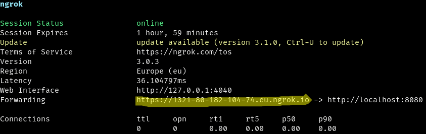

# @jackdbd/telegram-bot

My personal Telegram bot.

## Development

To develop this application you need to perform these tasks:

1. Compile TypeScript files in [watch mode](https://www.typescriptlang.org/docs/handbook/configuring-watch.html).
1. Create an HTTP tunnel with [ngrok](https://ngrok.com/) and forward webhook events from the public URL that ngrok assigns to you, to `localhost:8080`.
1. Watch the JavaScript files in `dist/` and restart the [functions-framework](https://github.com/GoogleCloudPlatform/functions-framework-nodejs) web server. I use [entr](https://github.com/eradman/entr) for this.
1. Make HTTP POST requests to the public URL that ngrok assigns to you, using an HTTP client like curl.

> :information_source: **Note:**
>
> You could create a script which combines these 4 tasks, but the output would be an absolute mess, so it's better to open 4 terminals (or 4 panes in Tmux).

### 1. create HTTP tunnel and forward requests

In one terminal, create an HTTP tunnel and forward the webhook events to `localhost:8080`

```sh
npm run http-tunnel -w packages/telegram-bot
```

Now copy the public, **Forwarding URL** that ngrok gave you, and assign it to the `TELEGRAM_BOT_URL` environment variable (for example, paste it in your `.envrc` file and reload it with `direnv allow`). Be sure not to include any trailing slashes.



> :information_source: **Note:**
>
> Now you can also:
> - visit http://localhost:4040/status to know the public URL ngrok assigned you.
> - visit http://localhost:4040/inspect/http to inspect/replay past requests that were tunneled by ngrok.

### 2. watch source files

In another terminal, compile TypeScript files in watch mode:

```sh
npm run build:watch -w packages/telegram-bot
```

### 3. watch compiled files and restart web server

In another terminal, reload the environment variables defined in your `.envrc`, then run the script which watches the JS files in `dist/` and restart the functions-framework web server:

```sh
direnv allow
npm run start:reloadable -w packages/telegram-bot
```

### 4. make POST requests to the bot

In another terminal, use an HTTP client like curl or httpie to make POST requests using some [test webhook events](../../assets/webhook-events/telegram/README.md).

Send a `text` [Message](https://core.telegram.org/bots/api#message) that contains the words `ciccio pasticcio`.

```sh
WEBHOOK_SECRET="$(
  cat ./secrets/telegram-bot.json | jq '.webhook_secret' | tr -d '"'
)" &&
curl "${TELEGRAM_BOT_URL}/telegraf" \
  -X POST \
  -H "Content-Type: application/json" \
  -H "X-Telegram-Bot-Api-Secret-Token: ${WEBHOOK_SECRET}" \
  -d "$(cat ./assets/webhook-events/telegram/hears-ciccio-pasticcio.json)"
```

Send a [sticker](https://core.telegram.org/bots/api#sticker).

```sh
WEBHOOK_SECRET="$(
  cat ./secrets/telegram-bot.json | jq '.webhook_secret' | tr -d '"'
)" &&
curl "${TELEGRAM_BOT_URL}/telegraf" \
  -X POST \
  -H "Content-Type: application/json" \
  -H "X-Telegram-Bot-Api-Secret-Token: ${WEBHOOK_SECRET}" \
  -d "$(cat ./assets/webhook-events/telegram/sticker.json)"
```

Send a bot command. Bot commands are text messages that start with `/` and must specify an array of [MessageEntity](https://core.telegram.org/bots/api#messageentity).

Send the bot command `/cocktail`.

```sh
WEBHOOK_SECRET="$(
  cat ./secrets/telegram-bot.json | jq '.webhook_secret' | tr -d '"'
)" &&
curl "${TELEGRAM_BOT_URL}/telegraf" \
  -X POST \
  -H "Content-Type: application/json" \
  -H "X-Telegram-Bot-Api-Secret-Token: ${WEBHOOK_SECRET}" \
  -d "$(cat ./assets/webhook-events/telegram/command-cocktail.json)"
```

Send the bot command `/firestore_list`.

```sh
WEBHOOK_SECRET="$(
  cat ./secrets/telegram-bot.json | jq '.webhook_secret' | tr -d '"'
)" &&
curl "${TELEGRAM_BOT_URL}/telegraf" \
  -X POST \
  -H "Content-Type: application/json" \
  -H "X-Telegram-Bot-Api-Secret-Token: ${WEBHOOK_SECRET}" \
  -d "$(cat ./assets/webhook-events/telegram/command-firestore_list.json)"
```

Send the bot command `/firestore_bulk_delete`.

```sh
WEBHOOK_SECRET="$(
  cat ./secrets/telegram-bot.json | jq '.webhook_secret' | tr -d '"'
)" &&
curl "${TELEGRAM_BOT_URL}/telegraf" \
  -X POST \
  -H "Content-Type: application/json" \
  -H "X-Telegram-Bot-Api-Secret-Token: ${WEBHOOK_SECRET}" \
  -d "$(cat ./assets/webhook-events/telegram/command-firestore_bulk_delete.json)"
```

Send the bot command `/hacker_news`.

```sh
WEBHOOK_SECRET="$(
  cat ./secrets/telegram-bot.json | jq '.webhook_secret' | tr -d '"'
)" &&
curl "${TELEGRAM_BOT_URL}/telegraf" \
  -X POST \
  -H "Content-Type: application/json" \
  -H "X-Telegram-Bot-Api-Secret-Token: ${WEBHOOK_SECRET}" \
  -d "$(cat ./assets/webhook-events/telegram/command-hacker_news.json)"
```

Send a callback query which is handled by a **specific bot action**.

```sh
WEBHOOK_SECRET="$(
  cat ./secrets/telegram-bot.json | jq '.webhook_secret' | tr -d '"'
)" &&
curl "${TELEGRAM_BOT_URL}/telegraf" \
  -X POST \
  -H "Content-Type: application/json" \
  -H "X-Telegram-Bot-Api-Secret-Token: ${WEBHOOK_SECRET}" \
  -d "$(cat ./assets/webhook-events/telegram/callback-query-authorize.json)"
```

Send a callback query which is not handled by a specific bot action, and so it is handled by the **catch all route**.

```sh
WEBHOOK_SECRET="$(
  cat ./secrets/telegram-bot.json | jq '.webhook_secret' | tr -d '"'
)" &&
curl "${TELEGRAM_BOT_URL}/telegraf" \
  -X POST \
  -H "Content-Type: application/json" \
  -H "X-Telegram-Bot-Api-Secret-Token: ${WEBHOOK_SECRET}" \
  -d "$(cat ./assets/webhook-events/telegram/callback-query-not-handled.json)"
```

> :information_source: **Note:**
>
> :stopwatch: To save some time, don't copy/paste these curl commands more than once per command. Instead, use the dashboard at http://localhost:4040/inspect/http to replay past requests that were tunneled by ngrok.

## Test

```sh
npm run test -w packages/telegram-bot
```

## Deploy

Deploy the application to [Cloud Functions 2nd generation](https://cloud.google.com/functions/docs/concepts/version-comparison).

```sh
npm run deploy -w packages/telegram-bot
```

## Commands for BotFather

Edit Bot > Edit Commands. Then copy-paste this:
<!-- human_in_the_loop - Human-in-the-loop workflow -->

```text
cocktail - Random cocktail from TheCocktailDB
firestore_list - List Firestore docs
firestore_bulk_delete - Bulk delete Firestore docs
hacker_news - Send links found on HN
random - Random stuff
sendpic - Send a photo
sendgif - Send a GIF
```
